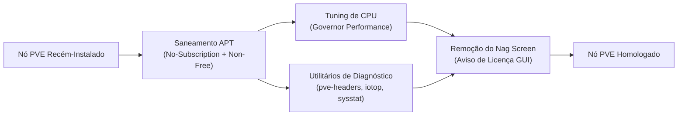

# ⚡ Proxmox VE: Pós-Instalação, Tweaks de Performance e Remoção de Nag

> [!info] Runbook corporativo para padronização de nós recém-instalados do Proxmox VE (PVE 8.x / PVE 9.x), cobrindo saneamento de repositórios via CLI, governança de CPU governor, instalação de ferramentas de diagnóstico e remoção segura do alerta de subscrição.

---

## 🧭 1. Visão Geral da Pós-Instalação

Logo após a instalação padrão do Proxmox VE, o nó precisa de ajustes determinísticos para operar com máxima estabilidade e sem alertas desnecessários em ambientes de laboratório ou pequenas operações corporativas:



---

## 📦 2. Saneamento dos Repositórios via CLI

Em instalações automatizadas ou headless, a configuração dos repositórios pode ser aplicada diretamente via shell Linux:

### Desativar Repositório Corporativo (Enterprise)
```bash
# Comentar a linha corporativa em pve-enterprise.list:
if [ -f /etc/apt/sources.list.d/pve-enterprise.list ]; then
    sed -i -e 's/^/#/' /etc/apt/sources.list.d/pve-enterprise.list
fi

# Desativar Ceph Enterprise se presente:
if [ -f /etc/apt/sources.list.d/ceph.list ]; then
    sed -i -e 's/^/#/' /etc/apt/sources.list.d/ceph.list
fi
```

### Habilitar Repositório Comunitário Gratuito (No-Subscription)
```bash
cat << 'EOF' > /etc/apt/sources.list.d/pve-no-subscription.list
# Repositório Proxmox VE No-Subscription
deb http://download.proxmox.com/debian/pve bookworm pve-no-subscription
EOF
```

### Atualizar o Cache e Pacotes do Host
```bash
apt-get update && apt-get dist-upgrade -y
```

---

## 🛠️ 3. Instalação de Utilitários de Diagnóstico & Headers

Pacotes essenciais para monitoramento de recursos e compilação de módulos de kernel:

```bash
apt-get install -y \
    pve-headers-$(uname -r) \
    build-essential \
    iotop \
    htop \
    sysstat \
    curl \
    ethtool \
    nvme-cli \
    smartmontools
```

---

## 🚀 4. Otimização de Performance: CPU Governor

Por padrão, distribuições baseadas em Debian configuram o governor da CPU em `powersave` ou `ondemand`, o que pode causar micro-latências em VMs críticas e bancos de dados:

```bash
# Instalar utilitário cpufrequtils:
apt-get install -y cpufrequtils

# Definir governor performance como padrão em todos os núcleos:
cat << 'EOF' > /etc/default/cpufrequtils
GOVERNOR="performance"
EOF

# Aplicar imediatamente:
systemctl restart cpufrequtils
```

Verifique o status dos núcleos com:
```bash
cat /sys/devices/system/cpu/cpu*/cpufreq/scaling_governor
```

---

## 🔕 5. Remoção Limpa do Aviso de Subscrição (Nag Screen)

O aviso modal *"No Valid Subscription"* pode ser suprimido de forma limpa no arquivo JavaScript da interface web (`proxmoxlib.js`):

```bash
# Backup do arquivo original:
cp /usr/share/javascript/proxmox-widget-toolkit/proxmoxlib.js \
   /usr/share/javascript/proxmox-widget-toolkit/proxmoxlib.js.bak

# Substituição cirúrgica do diálogo de subscrição:
sed -Ezi.bak "s/(Ext.Msg.show\(\{\s+title: gettext\('No valid sub)/void\(\{ \/\/\1/g" \
    /usr/share/javascript/proxmox-widget-toolkit/proxmoxlib.js

# Reiniciar o serviço do proxy web:
systemctl restart pveproxy.service
```

> [!tip] Limpe o cache do seu navegador (Ctrl + Shift + R) ao carregar novamente a interface web do Proxmox na porta `8006`.

---

## 🔗 Notas Relacionadas
- [Ativação de Repositório No-Subscription via GUI](01_ativar_repositorio_sem_subscricao_gui.md) — Configuração alternativa pela interface visual.
- [Criação e Otimização de VM Windows 11 no Proxmox](02_criacao_vm_windows11_otimizada.md) — Blueprint de performance com VirtIO e vTPM.
- [Backup, Snapshots e Estratégia de Storage](04_backup_snapshots_e_storage_zfs_lvm.md) — Governança de dados e retenção no Proxmox VE.
- [Guia Principal do Proxmox VE](README.md) — Índice de virtualização corporativa e infraestrutura.
- [Linux: Virtualização KVM/QEMU](../linux/05_virtualizacao_virt_manager.md) — Virtualização local com Virt-Manager no Linux.
