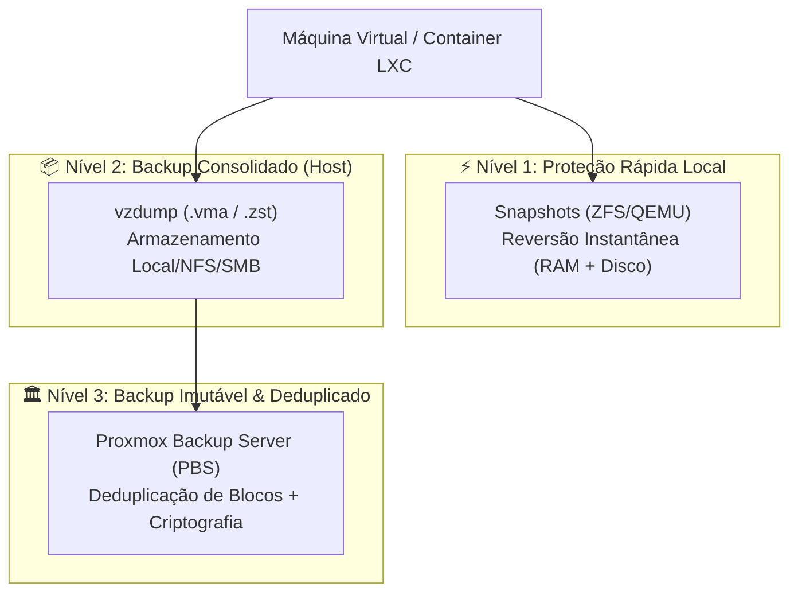

# 🛡️ Proxmox VE: Estratégias de Backup, Snapshots e Governança de Storage

> [!info] Guia de engenharia para garantia de continuidade operacional no Proxmox VE, abordando políticas de backup com `vzdump` / Proxmox Backup Server (PBS), ciclo de vida de snapshots consistentes e arquitetura de storage (ZFS vs LVM-Thin).

---

## 🧭 1. Camadas de Proteção de Dados

Uma estratégia profissional de alta disponibilidade e contingência no Proxmox combina múltiplos níveis de proteção:



---

## 📸 2. Snapshots Consistentes com QEMU Guest Agent

Snapshots capturam o estado dos discos e (opcionalmente) da memória RAM no exato momento da execução.

### Pré-requisito Crítico: QEMU Guest Agent
Para que o snapshot de uma máquina virtual em produção não corrompa bancos de dados (como PostgreSQL, MySQL ou Active Directory), o **QEMU Guest Agent** deve estar instalado e habilitado:
- No Linux: `qemu-guest-agent` emite o comando `fsfreeze` para pausar transações em disco.
- No Windows: O serviço interage com o **Volume Shadow Copy (VSS)** da Microsoft.

### Comandos de Gerenciamento via CLI:
```bash
# Criar snapshot com estado de memória RAM (tempo de recuperação zero):
qm snapshot 101 snap-homologacao --vmstate 1 --description "Antes de patch de seguranca"

# Listar snapshots da VM:
qm listsnapshot 101

# Reverter para o snapshot:
qm rollback 101 snap-homologacao

# Deletar snapshot após validação (libera espaço no storage):
qm delsnapshot 101 snap-homologacao
```

---

## 📦 3. Políticas de Backup com vzdump

O utilitário `vzdump` é o motor nativo de cópias de segurança do Proxmox:

### Modos de Backup Disponíveis:
| Modo | Funcionamento | Impacto na VM | Recomendação |
|---|---|---|---|
| **Snapshot** | Cria um COW (Copy-On-Write) em tempo real enquanto faz o streaming do disco | Sem downtime perceptível | Padrão ouro para produção |
| **Suspend** | Pausa temporariamente a execução da VM | Downtime de alguns segundos/minutos | Ambientes sem Guest Agent |
| **Stop** | Desliga a VM completamente antes do backup | Downtime total durante a cópia | Apenas em manutenções programadas |

### Exemplo de Rotina Automatizada via CLI:
```bash
# Backup em modo Snapshot com compressão Zstandard (zstd) de alta velocidade:
vzdump 101 --mode snapshot --compress zstd --storage local --mailnotification failure
```

---

## 💾 4. Arquitetura de Storage: ZFS vs LVM-Thin

A escolha da tecnologia de armazenamento no Proxmox define o teto de desempenho e os recursos disponíveis:

| Recurso | ZFS (ZFS Pool) | LVM-Thin (Local-LVM) |
|---|---|---|
| **Ideal para** | Múltiplos discos, tolerância a falhas, RAID de software | Disco único SSD/NVMe de altíssimo IOPS |
| **Integridade de Dados** | Checksumming nativo contra corrupção silenciosa | Gerenciado pelo sistema de arquivos guest |
| **Snapshots** | Nativos, instantâneos e com custo zero de criação | Suportados via metadados de volume thin |
| **Consumo de Memória** | Alto (requer ARC em RAM: ~1GB por TB de storage) | Mínimo (gerenciado diretamente pelo kernel) |
| **Compressão em Linha** | Nativa (LZ4 por padrão, alta economia de espaço) | Não suportada nativamente |

---

## 🔗 Notas Relacionadas
- [Pós-Instalação, Tweaks de Performance e Remoção de Nag](03_pos_instalacao_pve_tweaks_e_nag_removal.md) — Otimização inicial e governança de host.
- [Criação e Otimização de VM Windows 11 no Proxmox](02_criacao_vm_windows11_otimizada.md) — Configuração de VirtIO SCSI e TRIM.
- [Ativação de Repositório No-Subscription via GUI](01_ativar_repositorio_sem_subscricao_gui.md) — Atualizações seguras no Proxmox VE.
- [Guia Principal do Proxmox VE](README.md) — Índice de virtualização corporativa e infraestrutura.
- [Linux: Virtualização KVM/QEMU](../linux/05_virtualizacao_virt_manager.md) — Virtualização local com Virt-Manager no Linux.
