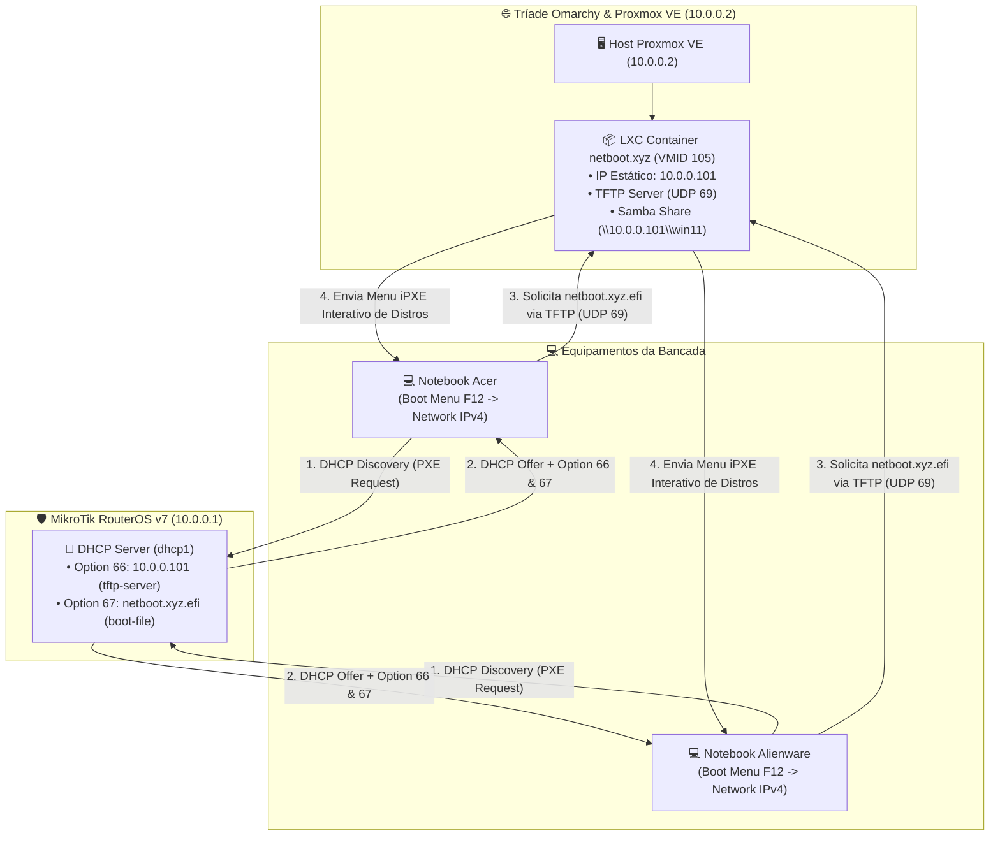

# 🚀 Servidor de Boot via Rede PXE com netboot.xyz no Proxmox VE & MikroTik RouterOS v7

O **netboot.xyz** é uma solução de boot PXE/iPXE extremamente leve e versátil que permite inicializar instaladores e ambientes ao vivo (*live ISOs*) de dezenas de distribuições Linux (Ubuntu, Fedora, Arch Linux, Debian, Pop!_OS, Alpine, AlmaLinux, Manjaro, Kali, etc.) e utilitários de diagnóstico (Memtest86+, GParted, Clonezilla) diretamente da rede local ou internet, sem a necessidade de gravar pendrives bootáveis.

Este manual cobre a implantação do **netboot.xyz** em um Container LXC no Proxmox VE, a integração DHCP no **MikroTik RouterOS v7** e os ajustes de BIOS/UEFI para notebooks Acer e Alienware.

---

## 🗺️ Arquitetura da Solução



---

## 📦 Parte 1: Implantação do LXC netboot.xyz no Proxmox VE

Container LXC 101 (`netboot-xyz`) provisionado no Proxmox VE (`10.0.0.2`) com IP estático `10.0.0.101/24` e gateway `10.0.0.1`:

```bash
pct create 101 local:vztmpl/debian-12-standard_12.12-1_amd64.tar.zst \
  --hostname netboot-xyz \
  --ostype debian \
  --cores 2 \
  --memory 2048 \
  --swap 512 \
  --rootfs local-lvm:33 \
  --net0 name=eth0,bridge=vmbr0,ip=10.0.0.101/24,gw=10.0.0.1 \
  --unprivileged 1 \
  --features nesting=1 \
  --onboot 1
```

---

## 🛡️ Parte 2: Configuração do DHCP Server no MikroTik RouterOS v7

Opções DHCP 66 e 67 configuradas com sucesso no MikroTik RouterOS v7 (`10.0.0.1`):

```routeros
# Option 66: IP do Servidor TFTP (LXC netboot.xyz)
/ip dhcp-server option
add code=66 name=tftp-server-ip value="'10.0.0.101'"

# Option 67: Nome do arquivo de boot para UEFI
add code=67 name=boot-file-name-uefi value="'netboot.xyz.efi'"

# Agrupar e vincular ao DHCP Server ativo (dhcp1)
/ip dhcp-server option sets
add name=pxe-boot-set options=tftp-server-ip,boot-file-name-uefi

/ip dhcp-server
set [find name=dhcp1] dhcp-option-set=pxe-boot-set
```

### 3. (Opcional Avançado) Suporte Híbrido UEFI + Legacy BIOS com Option Matcher

Se você quiser tratar dinamicamente clientes UEFI e Legacy BIOS no mesmo DHCP Server:

```routeros
# Matcher para identificar clientes UEFI (Arquitetura 00007 ou 00009)
/ip dhcp-server option matcher
add code=93 name=match-uefi-x64 server=dhcp1 value="0x0007"
add code=93 name=match-uefi-ia32 server=dhcp1 value="0x0009"

# Atribuir arquivo .efi para UEFI e .kpxe para Legacy
/ip dhcp-server option
add code=67 name=opt-uefi value="'netboot.xyz.efi'"
add code=67 name=opt-legacy value="'netboot.xyz.kpxe'"
```

---

## 💻 Parte 3: Configuração nos Notebooks (Acer & Alienware)

### 1. Ajustes na BIOS/UEFI

1. Ligue o notebook e pressione a tecla de SETUP (geralmente **F2** no Acer e **F2** / **Delete** no Alienware).
2. **Desativar Secure Boot**:
   - No **Acer**: Vá na aba *Security*, defina uma *Supervisor Password* temporária para liberar a opção *Secure Boot*, depois mude *Secure Boot* para `Disabled`.
   - No **Alienware**: Vá na aba *Boot* ou *Security* e defina *Secure Boot* como `Disabled`.
3. **Ativar Network Boot / PXE IPv4**:
   - Vá na aba *Main* ou *Boot*.
   - Ative *Network Boot* / *F12 Boot Menu* -> `Enabled`.
   - Certifique-se de que a opção *PXE IPv4 Boot* está habilitada na controladora de rede onboard.
4. Salve e saia (**F10**).

---

## 🚀 Parte 4: Procedimento de Boot e Formatação

1. Conecte o notebook Acer ou Alienware à rede local usando um **cabo Ethernet RJ-45**.
2. Ligue o notebook e pressione repetidamente a tecla **F12** para abrir o **Boot Menu**.
3. Selecione a opção de boot por rede (ex: `Realtek PCIe GBE / Onboard IPv4 PXE Boot`).
4. O notebook obterá o IP do MikroTik, baixará o binário `netboot.xyz.efi` do Proxmox LXC e exibirá o menu gráfico azul do **netboot.xyz**!

---

## 🛠️ Menu de Distribuições Disponíveis no netboot.xyz

No menu do netboot.xyz você poderá selecionar diretamente:
- **Linux Network Installs**:
  - Ubuntu (24.04 LTS, 22.04 LTS, Server / Desktop)
  - Debian (Bookworm, Trixie, Sid)
  - Fedora (Workstation, Server)
  - Arch Linux / EndeavourOS
  - Pop!_OS
  - Alpine Linux
  - AlmaLinux / Rocky Linux
  - Kali Linux
- **Utilities & Live Tools**:
  - Memtest86+ (Diagnóstico de RAM)
  - GParted Live (Gerenciamento de partições)
  - Clonezilla (Clonação de discos)
  - Boot Repair / Rescatux

---

## 🪟 Parte 5: Instalação do Windows 11 via Rede PXE

Ao contrário do Linux (cujo kernel e initrd são baixados nativamente via HTTP), o **Windows 11** exige o ambiente pré-instalação **WinPE** ou a tecnologia **wimboot** para carregar os arquivos `.wim` pela rede.

Existem duas formas principais de realizar a instalação do Windows 11 sem pendrive:

### Método 1: Ventoy WebPXE no LXC (Mais Simples para Windows 11)
Se o foco principal for a instalação do **Windows 11**:
1. No container LXC do VentoyPXE/Docker, monte uma pasta contendo a ISO oficial do **Windows 11 (`Win11_24H2_BrazilianPortuguese_x64.iso`)**.
2. O VentoyPXE serve o `wimboot` automaticamente via PXE.
3. No MikroTik, a **Option 67** apontará para o binário de boot do Ventoy (`ventoy.efi`).
4. Ao dar boot via F12, o instalador do Windows 11 carregará a tela inicial padrão de instalação.

### Método 2: WinPE + Compartilhamento Samba no netboot.xyz
1. Crie um compartilhamento Samba (SMB) no LXC contendo os arquivos extraídos da ISO do Windows 11 (`install.wim`, `setup.exe`).
2. Monte a imagem do WinPE (`winpe.wim`) no netboot.xyz.
3. Ao selecionar "Windows" no menu do netboot.xyz, o WinPE é carregado na RAM, executa um script `startnet.cmd` que mapeia a unidade de rede (`net use Z: \\192.168.88.10\win11`) e dispara o `Z:\setup.exe`.

> [!TIP]
> **Automação (Bypass de Requisitos & Conta Microsoft)**:
> É possível incluir um arquivo `autounattend.xml` no compartilhamento do Windows 11 para pular automaticamente a verificação de TPM/RAM, criar uma conta local offline e aceitar a licença sem intervenção manual.

---

## 🔗 Notas Relacionadas
- [Guia Principal do Proxmox VE](README.md) — Índice de virtualização corporativa e infraestrutura.
- [Criação de VM Windows 11 Otimizada](02_criacao_vm_windows11_otimizada.md) — Implantação e otimização de VMs no Proxmox.
- [Pós-Instalação, Tweaks de Performance e Remoção de Nag](03_pos_instalacao_pve_tweaks_e_nag_removal.md) — Saneamento do host PVE.

