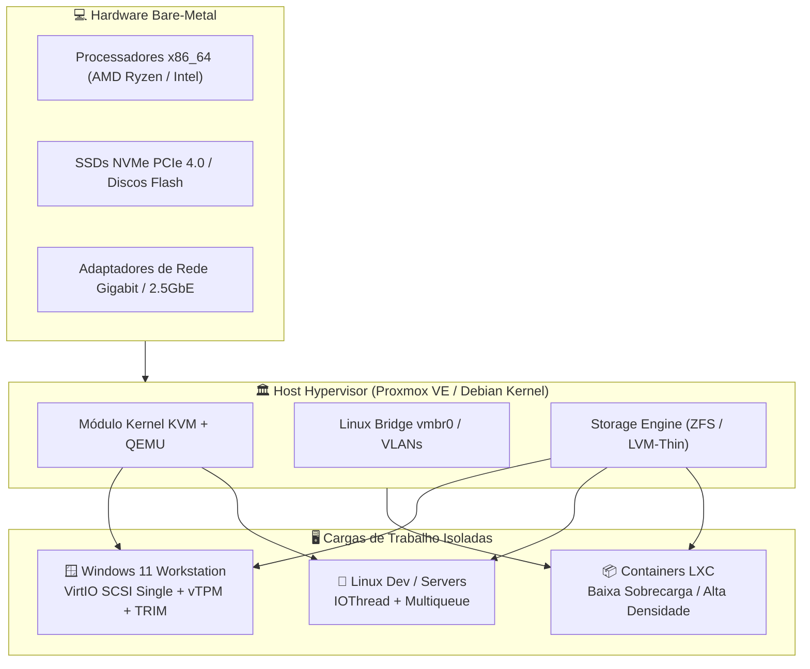

# 🌐 Proxmox VE: Virtualização Corporativa & Infraestrutura

Repositório público de engenharia de virtualização dedicado à administração avançada do **Proxmox Virtual Environment (PVE)**, hipervisor bare-metal open-source baseado em Debian e KVM/LXC.

Projetado como vitrine profissional de infraestrutura por **Bruno César** ([@brncesarms](https://github.com/brncesarms)), cobrindo desde o saneamento do host pós-instalação até a otimização extrema de máquinas virtuais e governança de armazenamento e backups.

---

## 🏛️ Arquitetura de Virtualização Tipo-1

O Proxmox VE consolida computação, rede e armazenamento em um stack unificado de alta densidade e isolamento seguro:

---

## 📖 Catálogo de Runbooks Técnicos

Notas atômicas estruturadas no formato Zettelkasten com autoria pessoal, tags contextuais e backlinks bidirecionais:

| # | Assunto | Descrição & Destaques Técnicos |
|---|---------|---------------------------------|
| 01 | [🌐 Ativação de Repositório No-Subscription via GUI](./01_ativar_repositorio_sem_subscricao_gui.md) | Procedimento visual via interface Web para desativar fontes enterprise e habilitar repositórios comunitários sem erros `401`. |
| 02 | [🚀 Criação & Otimização Extrema de VM Windows 11](./02_criacao_vm_windows11_otimizada.md) | Blueprint completo: VirtIO SCSI Single, IOThread, Discard/TRIM, vTPM 2.0, CPU Host, QEMU Guest Agent e debloat. |
| 03 | [⚡ Pós-Instalação, Tweaks de Performance e Remoção de Nag](./03_pos_instalacao_pve_tweaks_e_nag_removal.md) | Configuração via terminal das listas APT, tuning de CPU governor (`performance`), headers de kernel e remoção limpa do popup modal. |
| 04 | [🛡️ Backup, Snapshots e Estratégia de Storage (ZFS vs LVM-Thin)](./04_backup_snapshots_e_storage_zfs_lvm.md) | Retenção com `vzdump`, quiescing de arquivos com Guest Agent (VSS/fsfreeze), integração com PBS e comparativo de storage. |

---

## ⚙️ Diretrizes de Engenharia (Padrão Enterprise)

- **Zero Gambiarras de Hardware**: Uso de tipo de CPU `host` para exposição direta de instruções modernas de criptografia (AES-NI) e paralelismo (AVX2/AVX-512).
- **Eficiência de I/O em Flash**: Todo drive virtual em SSD NVMe adota controladora `virtio-scsi-single` com flag `iothread=1` e `discard=on` (TRIM periódico para não degradar a vida útil do drive).
- **Quiescing de Filesystem**: Backups e snapshots sempre orquestrados em conjunto com o `qemu-guest-agent` ativo para evitar perda de transações em bancos de dados.

---

## 🔗 Repositórios Relacionados no Ecossistema

- 🐧 [linux](https://github.com/brncesarms/linux) — Virtualização local com KVM/Virt-Manager, containers e tuning de SO.
- 🪟 [windows](https://github.com/brncesarms/windows) — Otimização de estações Windows 11, OpenSSH corporativo e automação com WinGet.
- 🌐 [redes](https://github.com/brncesarms/redes) — Topologia de rede, bridges virtuais, MikroTik e VPN Tailscale.
- 🤖 [ia](https://github.com/brncesarms/ia) — Inferência local com Ollama, benchmarks MoE e arquitetura RAG.
- 🧰 [scripts](https://github.com/brncesarms/scripts) — Toolbox multiplataforma de scripts Bash, Python e PowerShell.

---

## 📜 Licença

Distribuído sob a licença **MIT**. Consulte `LICENSE` para mais detalhes.  
Criado e mantido por **Bruno César** ([@brncesarms](https://github.com/brncesarms)).
