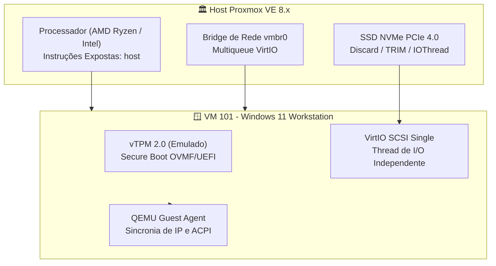

# 🚀 Guia Definitivo: Criação & Otimização Extrema de VM Windows 11 no Proxmox VE

> **Classificação de Privacidade:** 🟢 **PÚBLICO (`privacy: public`)**  
> **Compatibilidade:** Proxmox VE 8.x / Windows 11 23H2 e 24H2 / Hardware moderno (Mini PCs, GEEKOM, Ryzen, Intel Core)

---

## 🧭 1. Visão Geral da Arquitetura

Instalar o Windows 11 com as configurações padrões de assistente gráfico no Proxmox frequentemente resulta em **lentidão de disco, alto consumo de CPU e falhas de compatibilidade** com o instalador da Microsoft (exigência de TPM 2.0 e Secure Boot).

Este blueprint aplica as **melhores práticas da indústria (Padrão Enterprise)** para entregar uma máquina virtual com desempenho próximo ao bare-metal (*near-native*), com aceleração direta de I/O em SSDs NVMe e aproveitamento total das instruções da CPU.



---

## 🛠️ 2. As 6 Otimizações Críticas Explicadas

| Componente | Configuração Recomendada | Por que adotar? (Vantagem Técnica) |
|---|---|---|
| **CPU Type** | `host` | Expõe instruções nativas (AVX-512, AES-NI, SSE4.2), eliminando o overhead de emulação do `kvm64`. |
| **Controladora de Disco** | `virtio-scsi-single` + `iothread=1` | Cria uma fila dedicada de I/O para o disco da VM em thread separada da CPU principal, destravando a taxa de IOPS do NVMe. |
| **Flags de Disco** | `discard=on` + `ssd=1` + `cache=none` | Habilita o TRIM no Windows (libera blocos vazios no storage LVM-Thin/ZFS) e sinaliza ao Windows que o drive é flash. |
| **Rede** | `virtio` com `multiqueue=4` | Distribui o processamento dos pacotes de rede entre múltiplos núcleos da VM. |
| **Segurança & BIOS** | `OVMF (UEFI)` + `vTPM 2.0` | Atende aos requisitos oficiais da Microsoft sem necessidade de hacks no registro (`BypassTPMCheck`). |
| **Memória** | `ballooning` ativado | Permite ao Proxmox recuperar memória RAM não utilizada dinamicamente. |

---

## 💻 3. Pré-Requisitos (ISOs Necessárias)

Faça o download das duas imagens no storage ISO do Proxmox:
1. **ISO Oficial do Windows 11:** [Microsoft Windows 11 Download](https://www.microsoft.com/software-download/windows11)
2. **ISO Oficial dos Drivers VirtIO para Windows:**  
   ```bash
   # Download direto da ISO mais recente dos drivers VirtIO no Proxmox:
   wget -P /var/lib/vz/template/iso/ https://fedorapeople.org/groups/virt/virtio-win/direct-downloads/latest-virtio/virtio-win.iso
   ```

---

## ⚡ 4. Script Declarativo de Criação (`qm create`)

Execute este comando diretamente no terminal do Proxmox para provisionar a VM com todas as otimizações aplicadas de fábrica:

```bash
# Provisiona a VM 101 com parâmetros otimizados
qm create 101 \
  --name win11-workstation \
  --ostype win11 \
  --machine q35 \
  --bios ovmf \
  --efidisk0 local-lvm:0,efitype=4m,pre-enrolled-keys=1 \
  --tpmstate0 local-lvm:0,version=v2.0 \
  --cpu host,flags=+hyperv_relaxed;+hyperv_vapic;+hyperv_spinlocks \
  --cores 6 \
  --sockets 1 \
  --memory 8192 \
  --balloon 4096 \
  --scsihw virtio-scsi-single \
  --scsi0 local-lvm:64,discard=on,ssd=1,iothread=1,cache=none \
  --net0 virtio,bridge=vmbr0,multiqueue=4 \
  --agent enabled=1,fstrim_cloned_disks=1 \
  --vga virtio \
  --ide2 local:iso/Win11_24H2_BrazilianPortuguese_x64.iso,media=cdrom \
  --ide0 local:iso/virtio-win.iso,media=cdrom \
  --boot order="ide2;scsi0"
```

> [!TIP]
> Ajuste o nome da ISO do Windows e a capacidade de disco (`local-lvm:64` para 64 GB, ou o tamanho que desejar) conforme o seu storage.

---

## 🪟 5. Processo de Instalação do Windows 11

1. **Inicie a VM** pelo console Proxmox (`qm start 101`).
2. Pressione qualquer tecla para dar boot pelo CD/DVD.
3. **Tela de Seleção de Disco:** O instalador do Windows informará que não encontrou nenhum disco (pois a controladora VirtIO SCSI não possui driver nativo no instalador padrão da Microsoft).
4. Clique em **"Carregar Driver" (Load Driver)**:
   * Navegue até a unidade de CD dos drivers VirtIO (`virtio-win`).
   * Selecione a pasta: `vioscsi` ➔ `w11` ➔ `amd64`.
   * Clique em Avançar: o disco NVMe virtual de 64 GB aparecerá instantaneamente!
5. Prossiga com a instalação normal do Windows até a área de trabalho.

---

## 🔧 6. Pós-Instalação: Ferramentas & Otimizações Finais

Assim que o Windows iniciar:

### Passo 1: Instalar o Pacote Completo de Drivers VirtIO
Abra o Windows Explorer, acesse a unidade do CD `virtio-win` e execute o instalador:
```text
D:\virtio-win-gt-x64.exe
```
Selecione para instalar todos os componentes (incluindo o **QEMU Guest Agent** e o driver de rede `NetKVM`).

### Passo 2: Ajuste de Energia para Alta Performance (Terminal PowerShell)
Evita que a máquina virtual entre em suspensão ou desligue adaptadores de rede virtuais:

```powershell
powercfg /SETACTIVE SCHEME_CURRENT
powercfg /change standby-timeout-ac 0
powercfg /change hibernate-timeout-ac 0
```

### Passo 3: Provisionamento Automatizado de Softwares via Winget
Instale todos os utilitários essenciais da bancada de forma não interativa e silenciosa:

```powershell
winget install --id Microsoft.PowerToys -e --silent --accept-package-agreements --accept-source-agreements
winget install --id Git.Git -e --silent --accept-package-agreements --accept-source-agreements
winget install --id 7zip.7zip -e --silent --accept-package-agreements --accept-source-agreements
winget install --id Google.Chrome -e --silent --accept-package-agreements --accept-source-agreements
```

---

## 🛡️ 7. Validação & Manutenção no Proxmox

Após instalar o Guest Agent, o Proxmox exibirá o endereço IP real da VM na interface web sem necessidade de login.

Comandos operacionais úteis no host Proxmox:
```bash
# Desligamento limpo e seguro via ACPI/Guest Agent:
qm shutdown 101

# Criação de snapshot com estado de RAM antes de atualizações:
qm snapshot 101 snap-pre-update --vmstate 1

# Execução manual de TRIM para liberar espaço em disco:
qm guest cmd 101 fstrim
```
